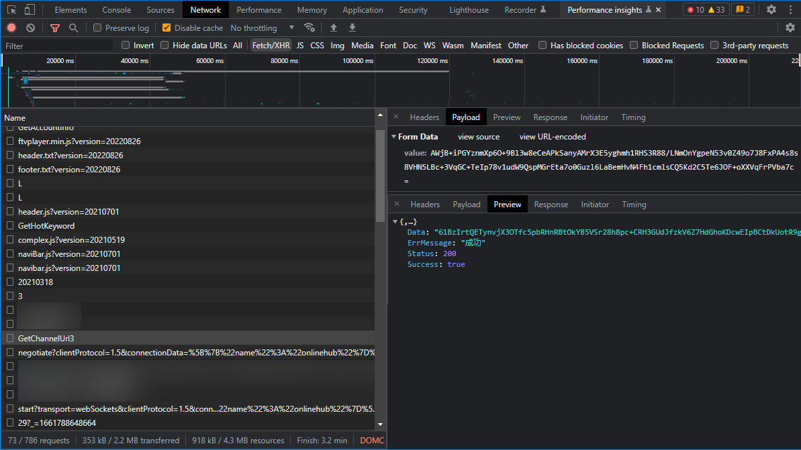
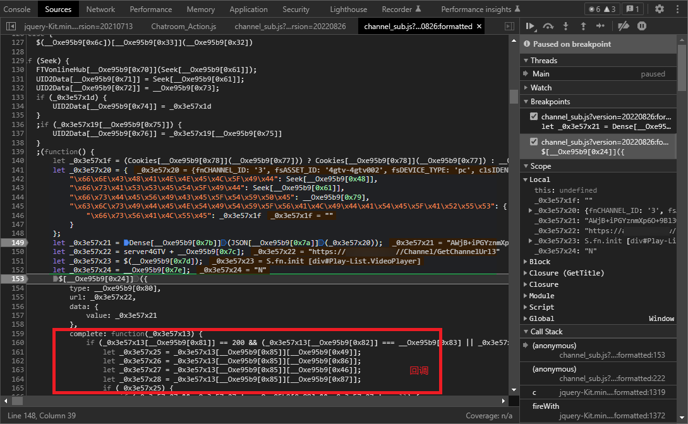
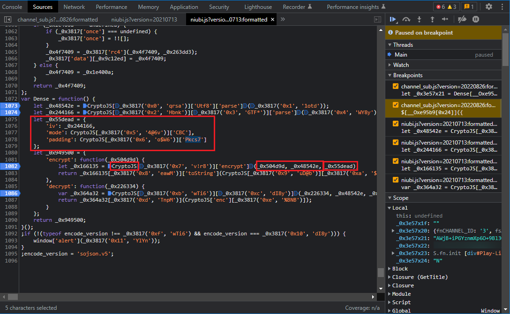
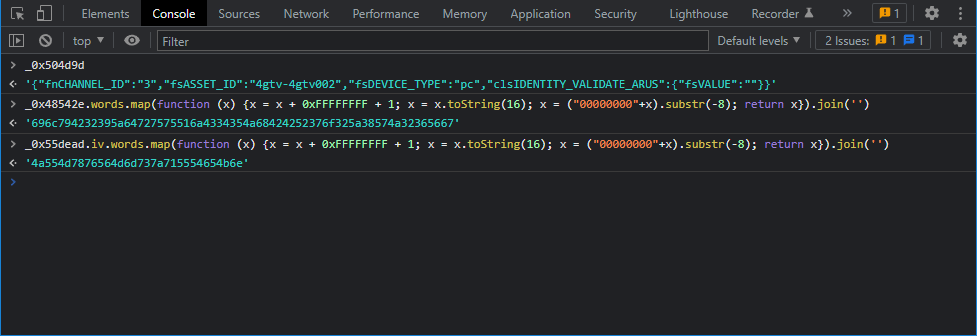

# 某网站会员绕过的一些猜测
最近看了些综艺节目，我发现某些华语综艺节目，嗝...很下饭，便逐渐不满足于网上的回放，想找点直播来看。

经过一番搜索，发现了一个网站有些频道，但其中绝大部分都需要会员订阅，鉴于付费方式的限制，我也无法获取会员。于是经过一些尝试，就有了本轻松下饭伪技术文。

## 逆向获取接口
网站地址：`aHh4cHM6Ly93d3cuNGd0di50di9jaGFubmVs`（该网站有访问限制，随缘可用）
F12，随便打开一个频道，先整体浏览一遍，发现绝大部分都是明文，仅有一条 `/Channel/GetChannelUrl3` 请求被加密：

其他位置未发现与 hls 相关的请求，估计就是这儿了。
payload 和返回数据均被加密，看一下调用，最后调用的俩应该是发送请求的，`channel_sub` 这个 `js` 看名字有点料，下几个断点，F5：

整个请求的构造都非常直接，很容易就找到了加密的关键位置，
`
let _0x3e57x21 = Dense[__Oxe95b9[0x7b]](JSON[__Oxe95b9[0x7a]](_0x3e57x20));
`
下断，F5，跟进去看看：

`niubi.js` 哈哈哈哈哈，🐂🍺，关键词：`CryptoJS`、`CBC`、`Pkcs7`，是 `AES`，`key` 和 `iv` 也 dump 出来：

请求参数为：
```json
{
    "fnCHANNEL_ID": "3",
    "fsASSET_ID": "002",
    "fsDEVICE_TYPE": "pc",
    "clsIDENTITY_VALIDATE_ARUS": {
        "fsVALUE": ""
    }
}
```
请求回调 `complete:` 处断下来，发现解密就是上上图中的 `decrypt`，有点6啊，解密结果：
（为脱敏，后文中网址均替换为：`{{site}}`）
```json
{
    "fsCHANNEL_NAME": "Beyond",
    "flstURLs": [
        "https://{{site}}free-cds.cdn.hinet.net/live/pool/{{site}}-live155/{{site}}-live-mid/index.m3u8?token=_O8WtLf90Vyb1hTlfFR9eA&expires=1661862814&token1=XS4M_JsBP9RTFSUuZWhmWA&expires1=1661862814",
        "https://{{site}}free-mozai.{{site}}.tv/khNsz1cqBmz9QtoyZBGGq9jKucXW-NxWWhq-mZSLKuc%3d/index.m3u8?token=i3cxZtOgdz1X7PlJ4e-eOw&expires=1661834014&token1=rwkVKauM64pQyPPXDbqc1w&expires1=1661834014&refer=ZGVmMWQ5ZmQtNDg0My00ZGRlLTg0YmUtNzY5YmFlNDkwMTgy&y=0"
    ]
    ...
}
```
正是想要的，我就喜欢这么直接的... 既然如此那先把加解密写了好了：
```python
import json
from base64 import b64decode, b63encode

from Crypto.Cipher import AES
from Crypto.Util.Padding import pad, unpad

class aTV():
    def __init__(self) -> None:
        self.key = b"ilyB29ZdruuQjC45JhBBR7o2Z8WJ26Vg"
        self.iv  = b"JUMxvVMmszqUTeKn"

    def url3_encrypt(body: dict) -> str:
        value = json.dumps(body).encode("utf8")
        cipher = AES.new(self.key, AES.MODE_CBC, self.iv)
        ct_bytes = cipher.encrypt(pad(value, AES.block_size))
        return b64encode(ct_bytes).decode('utf8')

    def url3_decrypt(data: str) -> bytes:
        ct_bytes = b64decode(data.encode("utf8"))
        cipher = AES.new(self.key, AES.MODE_CBC, self.iv)
        pt_bytes = cipher.decrypt(ct_bytes)
        return unpad(pt_bytes, AES.block_size)
```

## vip ts 片段尝试
hls 直播通过定时轮询服务器获取最新的 ts 片段，这些 ts 片段往往尺寸很小，所以数量也就很庞大。

为了便于理解，开发者可能会使用某些具有规律的文件命名规则，若 cdn 又没做访问限制，这就给了绕过的可乘之机。

### 先看看非会员的
```bash
curl --ssl-no-revoke -x http://localhost:10809 "https://{{site}}free-mozai.{{site}}.tv/khNsz1cqBmz9QtoyZBGGq9jKucXW-NxWWhq-mZSLKuc%3d/index.m3u8?token=i3cxZtOgdz1X7PlJ4e-eOw&expires=1661834014&token1=rwkVKauM64pQyPPXDbqc1w&expires1=1661834014&refer=ZGVmMWQ5ZmQtNDg0My00ZGRlLTg0YmUtNzY5YmFlNDkwMTgy&y=0"
#EXTM3U
#EXT-X-VERSION:3
#EXT-X-STREAM-INF:PROGRAM-ID=1,BANDWIDTH=400000,CODECS="avc1.77.30,mp4a.40.2",RESOLUTION=640x360
stream0.m3u8?token=i3cxZtOgdz1X7PlJ4e-eOw&expires=1661834014&refer=ZGVmMWQ5ZmQtNDg0My00ZGRlLTg0YmUtNzY5YmFlNDkwMTgy&token1=rwkVKauM64pQyPPXDbqc1w&expires1=1661834014&y=0&vt=
#EXT-X-STREAM-INF:PROGRAM-ID=1,BANDWIDTH=800000,CODECS="avc1.77.30,mp4a.40.2",RESOLUTION=854x480
stream1.m3u8?token=i3cxZtOgdz1X7PlJ4e-eOw&expires=1661834014&refer=ZGVmMWQ5ZmQtNDg0My00ZGRlLTg0YmUtNzY5YmFlNDkwMTgy&token1=rwkVKauM64pQyPPXDbqc1w&expires1=1661834014&y=0&vt=
#EXT-X-STREAM-INF:PROGRAM-ID=1,BANDWIDTH=1500000,CODECS="avc1.100.41,mp4a.40.2",RESOLUTION=1280x720
stream2.m3u8?token=i3cxZtOgdz1X7PlJ4e-eOw&expires=1661834014&refer=ZGVmMWQ5ZmQtNDg0My00ZGRlLTg0YmUtNzY5YmFlNDkwMTgy&token1=rwkVKauM64pQyPPXDbqc1w&expires1=1661834014&y=0&vt=
```
这是个播放列表，最高分辨率 720p，然后有 token 验证，是服务器下发的，但试了下是无需 cookies 即可获取的。
### 浅试一下
一个很有意思的事情：分辨率由低到高分别对应 `stream0` `stream1` `stream2`，那 1080p 是否对应 `stream3` 呢？
```
curl --ssl-no-revoke -x http://localhost:10809 "https://{{site}}free-mozai.{{site}}.tv/khNsz1cqBmz9QtoyZBGGq9jKucXW-NxWWhq-mZSLKuc%3d/stream3.m3u8?token=i3cxZtOgdz1X7PlJ4e-eOw&expires=1661834014&refer=ZGVmMWQ5ZmQtNDg0My00ZGRlLTg0YmUtNzY5YmFlNDkwMTgy&token1=rwkVKauM64pQyPPXDbqc1w&expires1=1661834014&y=0&vt="
#EXTM3U
#EXT-X-VERSION:3
#EXT-X-TARGETDURATION:6
#EXT-X-MEDIA-SEQUENCE:1661697552
#EXTINF:6.000000,
https://{{site}}free-cds.cdn.hinet.net/live/pool/{{site}}-live155/{{site}}-live-mid/10801661697552.ts?token1=rwkVKauM64pQyPPXDbqc1w&expires1=1661834014
#EXTINF:6.000000,
https://{{site}}free-cds.cdn.hinet.net/live/pool/{{site}}-live155/{{site}}-live-mid/10801661697553.ts?token1=rwkVKauM64pQyPPXDbqc1w&expires1=1661834014
```
请求成功，有戏！
```
curl --ssl-no-revoke -x http://localhost:10809 -s ”https://{{site}}free-cds.cdn.hinet.net/live/pool/{{site}}-live155/{{site}}-live-mid/10801661697679.ts?token1=rwkVKauM64pQyPPXDbqc1w&expires1=1661834014“ -o - | xxd -l 0xbc -
00000000: 4740 1112 0042 3f00 013f 00ef a3b5 01ef  G@...B?..?......
00000010: a3b5 0001 e9bd b914 4812 0106 4646 6d70  ........H...FFmp
00000020: 6567 0953 6572 7669 6365 3031 7130 6a1a  eg.Service01q0j.
00000030: efa3 b5ef a3b5 efa3 b5ef a3b5 efa3 b5ef  ................
00000040: a3b5 efa3 b5ef a3b5 efa3 b5ef a3b5 efa3  ................
00000050: b5ef a3b5 efa3 b5ef a3b5 efa3 b5ef a3b5  ................
00000060: efa3 b5ef a3b5 efa3 b5ef a3b5 efa3 b5ef  ................
00000070: a3b5 efa3 b5ef a3b5 efa3 b5ef a3b5 efa3  ................
00000080: b5ef a3b5 efa3 b5ef a3b5 efa3 b5ef a3b5  ................
00000090: efa3 b5ef a3b5 efa3 b5ef a3b5 efa3 b5ef  ................
000000a0: a3b5 efa3 b5ef a3b5 efa3 b5ef a3b5 efa3  ................
000000b0: b5ef a3b5 efa3 b5ef a3b5 efa3            ............
```
哈哈哈哈哈哈哈哈哈，不愧是我，完全没问题，成功绕过。
### 另一类链接
多试了一些频道，又发现另一类链接，两种数量大概对半分：
```json
{
    "fsCHANNEL_NAME": "娱乐台",
    "flstURLs": [
        "https://{{site}}freepc-cds.cdn.hinet.net/live/pool/{{site}}-{{site}}040/{{site}}-live-mid/index.m3u8?token=FriDsLwd4NTuQ5FiqaGWPw&expires=1661881229&token1=738AMMnK91egpWtMNNctAQ&expires1=1661881229",
        "https://{{site}}freepc-mozai.{{site}}.tv/PF_inTsb94AOHoWhn0vymIpD_8T477VkmA7xls5nFcQ%3d/index.m3u8?token=SjPggkQcts2IxR4dZrP47g&expires=1661852429&token1=hzjnFoWESog3qnb52zKCuQ&expires1=1661852429&refer=NTgxZmExZmQtMjA3ZC00YTkxLTlhN2YtMjczZmMzZGE3Y2Rk&y=0"
    ]
    ...
}
```
如法炮制：
```bash
curl -x http://localhost:7890 "https://{{site}}freepc-mozai.{{site}}.tv/8MubigapL-t5BTx2ZdLhmeI0kMFZKQUCZIDjoD2ixKg%3d/stream3.m3u8?token=JyIxyWnNnyS-5vZYJTkKYg&expires=1661811744&refer=NWRmZTAyZDQtNTI0Zi00NjcxLWFhNDItZjFiMWZlYTA3MDM0&token1=zHb2Il4sp2cQgEqKr61BPg&expires1=1661811744&y=0&vt=" -o -
#EXTM3U
#EXT-X-VERSION:3
#EXT-X-TARGETDURATION:4
#EXT-X-MEDIA-SEQUENCE:60430924
#EXT-X-INDEPENDENT-SEGMENTS
#EXTINF:4,
https://{{site}}freepc-cds.cdn.hinet.net/live/pool/{{site}}-{{site}}040/{{site}}-live-mid/{{site}}-{{site}}040-avc1_6000000=1-mp4a_139000_zho=6-begin=2417237270000000-dur=40000000-seq=60430932.ts?token1=zHb2Il4sp2cQgEqKr61BPg&expires1=1661811744
#EXTINF:4,
https://{{site}}freepc-cds.cdn.hinet.net/live/pool/{{site}}-{{site}}040/{{site}}-live-mid/{{site}}-{{site}}040-avc1_6000000=1-mp4a_139000_zho=6-begin=2417237310000000-dur=40000000-seq=60430933.ts?token1=zHb2Il4sp2cQgEqKr61BPg&expires1=1661811744
```
但下一秒就愣住(°ー°〃)了，因为请求结果 404
咦，再试几次，依旧 404，不应该啊，一路顺风顺水，突然的 404 有嗲猝不及防
是 cookies 的原因吗？无解了吗？
再试试！
### 柳暗花明
仔细看 ts 链接，`free` 莫非是免费用户的？去掉试试：
```bash
curl --ssl-no-revoke -x http://localhost:10809 "https://{{site}}pc-cds.cdn.hinet.net/live/pool/{{site}}-{{site}}040/{{site}}-live-mid/{{site}}-{{site}}040-avc1_6000000=1-mp4a_139000_zho=6-begin=2417238910000000-dur=40000000-seq=60430973.ts?token1=zHb2Il4sp2cQgEqKr61BPg&expires1=1661811744"
404 Not Found
```
404 依旧，再往后看，`mid` 莫非代表的是 中等分辨率？那 1080p 对应的会是什么呢？ `high` 吗？
```bash
curl -s --ssl-no-revoke -x http://localhost:10809 "https://{{site}}pc-cds.cdn.hinet.net/live/pool/{{site}}-{{site}}040/{{site}}-live-high/{{site}}-{{site}}040-avc1_6000000=1-mp4a_139000_zho=6-begin=2417251310000000-dur=40000000-seq=60431283.ts?token1=zHb2Il4sp2cQgEqKr61BPg&expires1=1661811744" -o - | xxd -l 0xbc -
00000000: 4740 0013 0000 3f00 003f 0041 573f e6b2  G@....?..?.AW?..
00000010: b6ee 90b4 efa3 b5ef a3b5 efa3 b5ef a3b5  ................
00000020: efa3 b5ef a3b5 efa3 b5ef a3b5 efa3 b5ef  ................
00000030: a3b5 efa3 b5ef a3b5 efa3 b5ef a3b5 efa3  ................
00000040: b5ef a3b5 efa3 b5ef a3b5 efa3 b5ef a3b5  ................
00000050: efa3 b5ef a3b5 efa3 b5ef a3b5 efa3 b5ef  ................
00000060: a3b5 efa3 b5ef a3b5 efa3 b5ef a3b5 efa3  ................
00000070: b5ef a3b5 efa3 b5ef a3b5 efa3 b5ef a3b5  ................
00000080: efa3 b5ef a3b5 efa3 b5ef a3b5 efa3 b5ef  ................
00000090: a3b5 efa3 b5ef a3b5 efa3 b5ef a3b5 efa3  ................
000000a0: b5ef a3b5 efa3 b5ef a3b5 efa3 b5ef a3b5  ................
000000b0: efa3 b5ef a3b5 efa3 b5ef a3b5            ............
```
哈哈哈哈哈哈哈哈哈，成了！！！！！
### 第一条 hls 链接
解密后出来两条 hls，为啥没直接试第一条 hls 呢？因为第一条 hls 用到了视频参数，我猜了很久，不好猜。
而且两条 hls 最后得到的 ts 链接是一样的，所以仅用一条就好啦。
### 尝试本地生成 ts 链接
因为这网站访问太不稳定，经过多次尝试发现虽然 hls 链接有访问限制，但存在 cdn 上的 ts 没问任何限制，随便一个地区都可访问。

那一种想法是：能否在本地生成 ts 链接？

但现实是 token 无法生成，而且 token 又是必须的，这样就无法做到完全脱离服务器。

那退而求其次，能否在一个 token 的有效期内完全脱离服务器呢？

再看一下两种 ts 链接：
```bash
#EXTINF:6.000000,
/10801661697552.ts
#EXTINF:6.000000,
/10801661697553.ts

#EXTINF:4,
/{{site}}-{{site}}040-avc1_6000000=1-mp4a_139000_zho=6-begin=2417237270000000-dur=40000000-seq=60430932.ts
#EXTINF:4,
/{{site}}-{{site}}040-avc1_6000000=1-mp4a_139000_zho=6-begin=2417237310000000-dur=40000000-seq=60430933.ts
```
第一种去掉 1080 后面看起像时间戳，但 ts 时长是 6s，却是递增的，那只要获取每个 ts 的时长就行了。
第二种有个 seq 看起来也是递增的，begin 应该是和时间相关的，间隔一算正好是 40000000，和 ts 时长一致。
下面就写一下代码：
```python
import re
import m3u8

class aTV():
    def __init__(self) -> None:
        pass

    def generate_ts(self, now: int, stream_info: dict) -> m3u8.M3U8:
        """
        now: 当前时间
        stream_info: 存放频道信息和上次同步服务器的获取的各种信息
        """
        stream : m3u8.M3U8 = copy.deepcopy(stream_info["stream"])
        # 计算递增时间间隔
        seq_interval = round((now - stream_info["time"]) / stream.segments[0].duration)
        # 计算 ts 链接递增变量的第一个值
        start_seq = seq_interval + stream.media_sequence
        # 匹配 begin 是否存在，存在就计算出间隔
        match0 = re.search(r"begin=(\d+)", stream.segments[0].uri)
        match1 = re.search(r"begin=(\d+)", stream.segments[1].uri)
        process_begin = match0 and match1
        if process_begin:
            begin = int(match0.groups()[0])
            interval = int(match1.groups()[0]) - begin
        # 重新生成 m3u8
        for i in range(len(stream.segments)):
            stream.segments[i].uri = stream.segments[i].uri.replace(
                f"{stream.media_sequence + i}.ts", f"{start_seq + i}.ts")
            if process_begin:
                stream.segments[i].uri = stream.segments[i].uri.replace(
                    f"begin={begin + i*interval}", f"begin={begin + (seq_interval+i)*interval}")
        stream.media_sequence = start_seq
        return stream
```
## 总结一下
这种过于规律的命名规则令过程变得比较顺利，但我在自己猜测的时候还是走了不少弯路，比如：上来就第一条 hls，结果头都大了，没啥结果，应该两手抓，看看哪个柿子软吃哪个；期间想搜索找找思路，受到了一些过时信息的错误引导，浪费不少时间。

感谢各位看官，一共大概猜了几个小时，代码又写了几个小时，猜的时候还是比较费头发的，点个热心呗~

项目已开源：https://github.com/yzctzl/awetv
